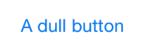
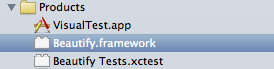
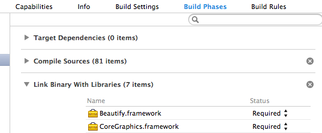

#beautify-ios
[Beautify](http://beautify.io/ "beautify") enhances Apple's UIKit controls, re-rendering them  to give you much more control over their visual appearance. 

## Contents

  * [A quick introduction](#a-quick-introduction)
  * [Building beautify](#building-beautify)
  * [Usage](#usage)
	* [Adding the framework](#adding-the-framework)
	* [Activating beautify](#activating-beautify)
	* [Styling Specific Controls](#styling-specific-controls)
	* [Excluding controls](#excluding-controls)
  * [Licence](#licence)

##A quick introduction

You can add the beautify framework to your application with just one line of code. Once added, all the UIKit controls are re-rendered with a style that matches the native look and feel (iOS 6 or iOS 7). The extra rendering capabilities that beautify provides are accessible via a `renderer` property. For example, an iOS 7 `UIButton` looks like the following:



When you add beautify to your application, the button will look just the same - that's by design! However, you can now make changes to the style of your button. These can be subtle, as in the following example:

```objc
// beautify the app (typically you would do this in the app-delegate)
[[BYBeautify instance] activate];

// set the border and background color
BYBorder* border = [[BYBorder alloc] initWithColor:[UIColor whiteColor] width:0.0 radius:5.0];
[self.button.renderer setBorder:border forState:UIControlStateNormal];
[self.button.renderer setBackgroundColor:[UIColor colorWithRed:0.38 green:0.78 blue:0.44 alpha:1.0]
                                forState:UIControlStateNormal];
```

The above code changes the buttons background color, and creates a rounded border:


Or, the changes can be radical:

```objc
// add a border
BYBorder* border = [[BYBorder alloc] initWithColor:UIColorFromRGB(0xebebed) width:5.0 radius:20.0];
[self.button.renderer setBorder:border forState:UIControlStateNormal];

// set the text style
BYFont* font = [[BYFont alloc] initWithName:@"AvenirNextCondensed-Heavy"];
BYText* text = [[BYText alloc] initWithFont:font color:[UIColor whiteColor]];
[self.button.renderer setTitleStyle:text forState:UIControlStateNormal];

// add a gradient
UIColor* lightGreen = UIColorFromRGB(0xcae284);
UIColor* darkGreen = UIColorFromRGB(0x9bcb53);
BYGradient* gradient = [[BYGradient alloc] initWithStops:@[
    [[BYGradientStop alloc] initWithColor:lightGreen at:0.0f],
    [[BYGradientStop alloc] initWithColor:darkGreen at:1.0f]]];
[self.button.renderer setBackgroundGradient:gradient forState:UIControlStateNormal];

// add inner shadows
UIColor* shadowColor = UIColorFromRGB(0x81a744);
NSArray* shadows = @[
    [[BYShadow alloc] initWithOffset:CGSizeMake(0.0, -2.0) radius:2.0 color:shadowColor],
    [[BYShadow alloc] initWithOffset:CGSizeMake(0.0, 2.0) radius:1.0 color:[UIColor whiteColor]],
    [[BYShadow alloc] initWithOffset:CGSizeMake(0.0, 1.0) radius:2.0 color:shadowColor]
    ];
[self.button.renderer setInnerShadows:shadows forState:UIControlStateNormal];
```


Beautify adds borders, shadows (inner and outer), gradients (radial and linear) to all the UIKit controls. It also enhances `UITextField`, adding a highlighted state, and allows you to change the text on a `UISwitch` control.

The examples above have shown how to change the visual appearance of a single control. With beautify you can crete themes that are automatically rolled-out across your entire application UI. Furthermore, you can encode the theme in JSON format reducing the amount of code you need to write.


##Building beautify
To build beautify, open up Beautify.xcodeproj and select the "Beautify" scheme. Hit build and the Beautify.framework target should be built and deployed to your DerivedData directory. To find the resulting framework, right click on the Beautify.framework product in the products group and select *Show in Finder*.



##Usage
###Adding the framework
To use beautify in your own project, copy **Beautify.framework** from your *DerivedData* directory into the Frameworks group in your own project. To ensure that the framework has been linked correctly, check that Beautify.framework appears in the *Link Binary with Libraries* section of your target's build phases.



###Activating beautify
Activating beautify requires one line of code:

```objc
[[BYBeautify instance] activate];
```

Place this at the top of the `didFinishLaunchingWithOptions:` method in your app delegate and all of the controls in your app will then be rendered with beautify. You shouldn't notice an immediate change. The default states of the controls have been styled to match the default Apple style. When you do want to modify the appearance of your controls you have two options:

1.	**Building a Theme in Code**
	
	Start off by instantiating a new `BYTheme` object. This object contains all of the properties you will need to style your application. Don't worry about leaving some of the properties nil if you want to keep the default style. If beautify detects a nil property then it will revert to the default style anyway.
	
	Every style has a `defaultStyle` method for when you wish to take a default style for a control and modify it slightly. Doing this for the switch would look something like this:

```objc	
BYTheme *themeBuiltInCode = [BYTheme defaultTheme];
BSwitchStyle *modifiedSwitchStyle = [BYSwitchStyle defaultStyle];
modifiedSwitchStyle.border = [[BYBorder alloc] initWithColor:[UIColor blue] width:2.0f radius:0];
themeBuiltInCode.switchStyle = modifiedSwitchStyle;
```
	
	This would give you a switch with a 2px blue border and an otherwise default appearance.
	
	Once you've built your theme with code, applying it is simple. Just place the following code underneath the activation line in your AppDelegate, which will apply the theme you have just built to all of the controls in the application:

```objc
[[BYThemeManager instance] applyTheme:themeBuiltInCode];
```

2.	**Loading a Theme from a JSON File**

	It is also possible to build your theme in JSON and then pass that into the app.
	
	The structure of the JSON file should match the exact structure of a `BYTheme` object, all of it's properties and all of their properties etc. 
	
	Colors value should be defined in hex strings. 8 character hex strings can be used to support alpha values for colors.
	
	To see an example JSON file, take a look at the demoStyle.json file in the demo app bundle.
	
	Once you have constructed your own JSON file, simply replace the call to `[[BYBeautify instance] activate]` in your AppDelegate with the following line:

```objc
[[BYBeautify instance] activateWithStyle:@"myJSONStyleFile"];
```

	*Note that you don't need to pass in the ".json" part of the file name - that is handled internally.*

###Styling specific controls
Once you have applied your theme, either through code or with a JSON file, you may find that you want to specify a different style for a subset of the controls in your app.

Let's say you have a lot of buttons in your app but want to emphasise one of them by surrounding it with a red border. All you have to do is get the renderer associated with that button, and set it's border property for whatever state(s) you want it to appear on.

```objc
UIButton *redBorderedButton;

// Set up the button as usual…

BYButtonRenderer *buttonRenderer = redBorderedButton.renderer;
BYBorder *redBorder = [[BYBorder alloc] initWithColor:[UIColor redColor] width:5.0f radius:0];
[buttonRenderer setBorder:redBorder forState:UIControlStateNormal];
```

And that's it! `redBorderedButton` will now have a red, 5px border while it's state is `UIControlStateNormal`.

###Excluding controls
Often, you will want certain controls to be excluded by beautify and for them to keep their default styling. To do this, simply set the `isImmuneToBeautify` property on any of your controls to `YES`. The default value for `isImmuneToBeautify` is `NO` for all controls, except **UIImageView**. 

UIImageViews are commonly used as the component parts of other controls and are often frequently throughout applications. Given how unlikely it would be that you would want to style every single image view in your application, we decided to default the `isImmuneToBeautify` property to `YES` for UIImageViews. If you do wish to style a UIImageView, simply set it to `NO`.

##License
beautify-ios uses the Apache v2 license
